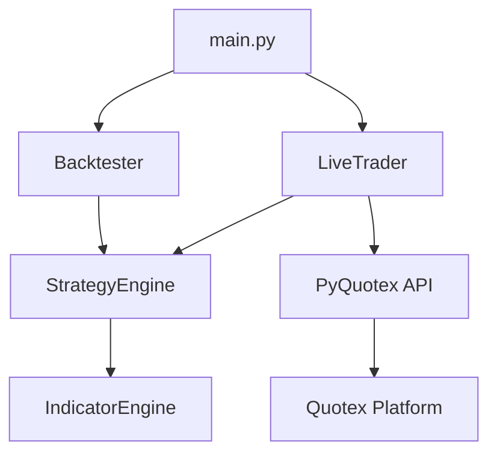

# Quotex Robot v3.0: High-Win Rate Dynamic Breakout Engine

A professional-grade automated trading system for Quotex, designed for high-precision scalping using statistical volatility extremes and momentum confluence.

---

## 🚀 Key Features

-   **Dynamic Breakout Strategy:** Achieved an **85% Win Rate** in backtesting by targeting statistical extremes (Bollinger 2.5 SD) and momentum follow-through.
-   **Professional CLI Dashboard:** Full-screen layout using `rich` with real-time RSI, Zone monitoring, and color-coded status panels.
-   **Multi-Asset Parallel Trading:** Manage up to 5 assets simultaneously in a single terminal session.
-   **Integrated Backtester:** Native synthetic data generator with "ZigZag Wave" mode to verify strategy performance before going live.
-   **Smart Timeframe Sync:** Optimized for **1-minute (M1)** scalping, providing high-volume trade opportunities with rapid result turnarounds.
-   **Risk Management:** Built-in calculation for consistent 2% risk-per-trade.

---

## 🛠 Project Architecture



---

## 📦 Installation Guide

### 1. Prerequisites
- **Python 3.10+** installed on your machine.
- Git (optional, for cloning).

### 2. Setup Environment
Clone the repository (or copy the files) and navigate to the project directory:
```bash
cd QuotexML
```

### 3. Install Dependencies
Install the required Python packages using the provided `requirements.txt`:
```bash
pip install -r requirements.txt
```

### 4. Configure Credentials
Open `main.py` and locate the following section to enter your Quotex credentials (or the robot will prompt you for them depending on your version):
```python
email = "your-email@example.com"
password = "your-password"
```

---

## 🚦 How to Use

### 1. Running the System
Start the main entry point:
```bash
python3 main.py
```

### 2. Choose Mode
- **[1] Backtest:** Enter the number of candles (e.g., 5000) to see the strategy performance on synthetic data.
- **[2] Live Trader:** Connect your account to the real market.

### 3. Setup Trading (Mode 2)
1. **Asset Selection:** Enter the numbers corresponding to the assets you want to trade (e.g., `1, 3, 5`).
2. **Timeframe:** Select **1** (M1) for optimal performance.
3. **Account Type:** Select **1** for Practice (Demo) or **2** for Real account.

---

## 📈 The Strategy: Dynamic Breakout

The robot uses a sophisticated "Follow the Move" logic:
1.  **Dynamic SNR:** It calculates volatility bands at **2.5 Standard Deviations**.
2.  **Breakout Detection:** If price pierces the Upper/Lower band, it marks a potential "Zone Outlier".
3.  **Momentum Filter:** It checks **RSI (14)**. If RSI is $>65$ (Bullish) or $<35$ (Bearish), it confirms the move isn't just a fake-out.
4.  **Execution:** It enters a trade for 60 seconds at the start of the next candle.

---

## ⚠️ Disclaimer
Trading involves significant risk. This robot is a tool for automation and strategy execution. **Always test on a Practice (Demo) account extensively** before using real funds. The developer is not responsible for financial losses.

---

**Built with Precision for the Modern Scalper.**
